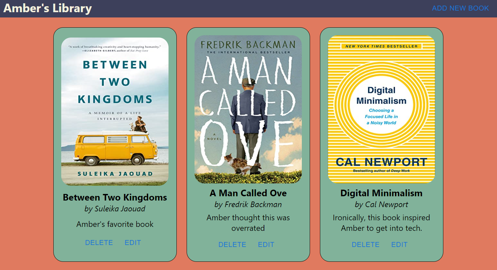
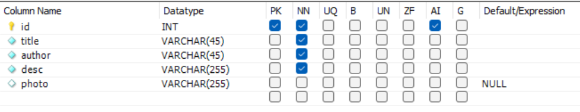

<h1 align="center" id="readme-top">Library App</h1>

A simple full CRUD app for books utilizing a MySQL database.

## Screenshot

## Future Improvements

This app is only in the beginning stages. With the frontend, I would like to improve A LOT. Very basic styling at the moment with lots of areas to improve in terms of design and overall responsiveness. Still need to adjust the colors for the Material UI components. In the backend - I want to add user registration/login and enable users to separate their books into various lists.

## View Project

This app is not currently deployed. To view this project, you will have to run it on your local machine.

### First, you will want to clone this GitHub repo and open in Visual Studio Code

Run the following commands:
<li>git clone https://github.com/amberhunt955/mysql-book-list.git</li>
<li>cd mysql-book-list</li>
<li>code .</li>

### Set up the backend

Run the following commands:
<li>cd backend</li>
<li>npm i</li>
<li>touch .env</li>

For this project you will need to connect to your own MySQL database. You will need to add your password to a variable PASSWORD in the .env file in the backend. You will also need to create a database called "test" (remind me to rename this later). The test database has a table called "books". The columns look like this:

### Set up the frontend

Run the following commands:
<li>cd frontend</li>
<li>npm i</li>
<li>touch .env</li>

You will need to add the REACT_APP_PORT variable to the .env file.

### Running the application

You will run "nodemon" in the backend and "npm start" in the frontend. That's it! Please don't hesitate to reach out if you encounter any issues.

## Contact

If you have any questions, please reach out to me on [LinkedIn](https://www.linkedin.com/in/amberhunt955).